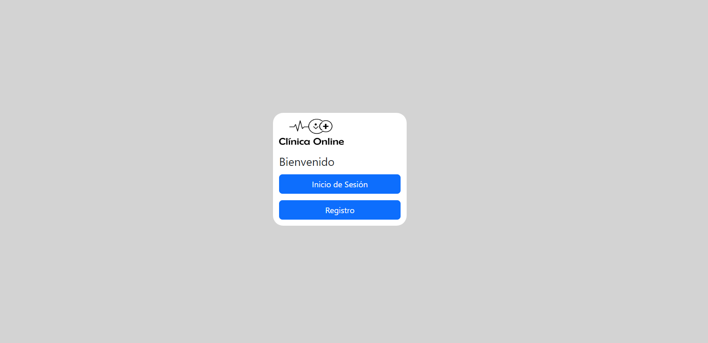
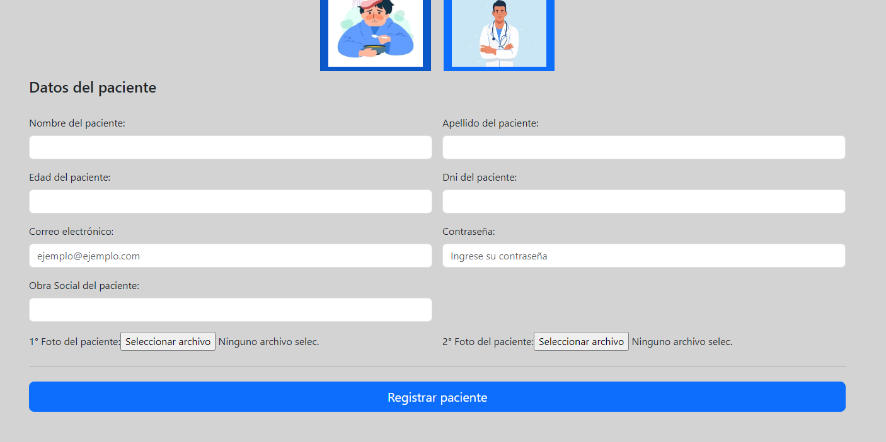
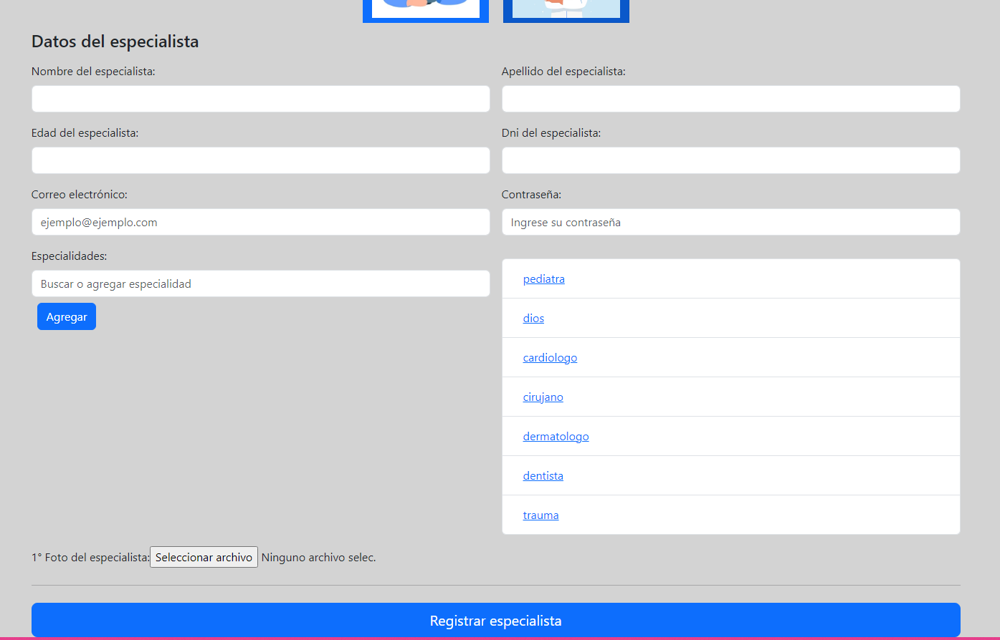
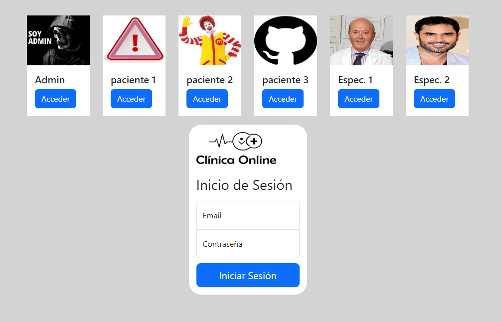

# Clinica Online

Proyecto elaborado para la materia laboratorio 4 en la UTN.
Utilización de Angular y Firebase

Puedes probar el funcionamiento del sistema en: https://clinicaonline-5cc5c.web.app/
## Authors

- [@MilagrosLuna](https://github.com/MilagrosLuna)

## Primeros pasos en la clinica

Cuando ingresas a la pagina te encontras en la bienvenida, donde si eres un nuevo usuario puedes dirigirte al registro o de lo contrario a iniciar sesión

## Registro

Aca podes elegir si queres registrar un paciente o especialista

## Paciente - Registro

Se piden los datos necesarios para integrar un paciente al sistema, este debe agregar 2 fotos

## Especialista - Registro

Se piden los datos necesarios para integrar un especialista al sistema, este debe agregar una foto y seleccionar sus especialidades

## Inicio sesión

Aca se ingresa el mail y contraseña, ademas contas con accesos rapidos.

