# Clínica Online

Sistema de turnos médicos con tres perfiles (paciente, especialista y administrador): registro con verificación, solicitud y gestión de turnos, historias clínicas, encuestas y estadísticas.

Proyecto hecho para la materia Laboratorio IV (UTN).

**Demo:** https://clinicaonline-5cc5c.web.app/


## Stack

- Angular 16 (módulos lazy, directivas y pipes propios)
- Firebase: Authentication, Firestore y Hosting
- Bootstrap 5, SweetAlert2, ngx-spinner
- ECharts (gráficos), pdfmake (PDF), xlsx (Excel)
- Google reCAPTCHA v2, EmailJS

## Correr el proyecto en local

Requisitos: Node 18+ y npm.

```bash
git clone https://github.com/MilagrosLuna/ClinicaOnline.git
cd ClinicaOnline
npm install      # crea src/environments/environment.ts desde la plantilla si no existe
npm start        # http://localhost:4200
```

Después completá `src/environments/environment.ts` (está en `.gitignore`):

| Constante | De dónde sale |
| --- | --- |
| `environment.firebase` | Consola de Firebase > Configuración del proyecto > Tus apps |
| `SERVICE_ID`, `TEMPLATE_ID`, `USER_ID` | Panel de EmailJS (formulario de contacto) |
| `CAPTCHA` | Site key de Google reCAPTCHA v2 |

## Perfiles y acceso

| Perfil | Cómo entra | Qué puede hacer |
| --- | --- | --- |
| Paciente | Registro + verificación de mail | Pedir, cancelar y calificar turnos, encuesta, historia clínica en PDF |
| Especialista | Registro + verificación + aprobación del admin | Aceptar, rechazar y finalizar turnos, cargar historia clínica, horarios |
| Administrador | Alta desde otro admin | Usuarios, turnos de todos, gráficos, exportar a Excel |

El login tiene botones de acceso rápido con usuarios demo de cada perfil.

Las rutas `/home/**` requieren sesión y `/homeAdmin/**` requiere ser administrador (`src/app/guards/auth.guards.ts`).

## Seguridad (Firestore)

Las reglas están en [`firestore.rules`](firestore.rules): todo requiere sesión, salvo `users` (accesos rápidos) y `especialidades` (registro), que se leen sin login. Para publicarlas:

```bash
firebase deploy --only firestore:rules
```

## Scripts

| Comando | Qué hace |
| --- | --- |
| `npm start` | Servidor de desarrollo |
| `npm run build` | Build de producción en `dist/clinica` |
| `npm run deploy` | Build + deploy a Firebase Hosting |
| `npm test` | Tests unitarios con Karma |

## Autora

[@MilagrosLuna](https://github.com/MilagrosLuna)

---

# Recorrido por la app

### Primeros pasos en la clinica

Cuando ingresas a la pagina te encontras en la bienvenida, donde si eres un nuevo usuario puedes dirigirte al registro o de lo contrario a iniciar sesión

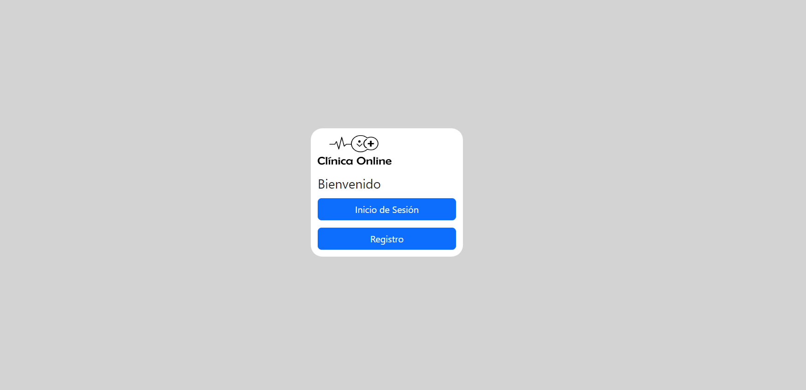

### Registro

Aca podes elegir si queres registrar un paciente o especialista


### Paciente - Registro

Se piden los datos necesarios para integrar un paciente al sistema, este debe agregar 2 fotos

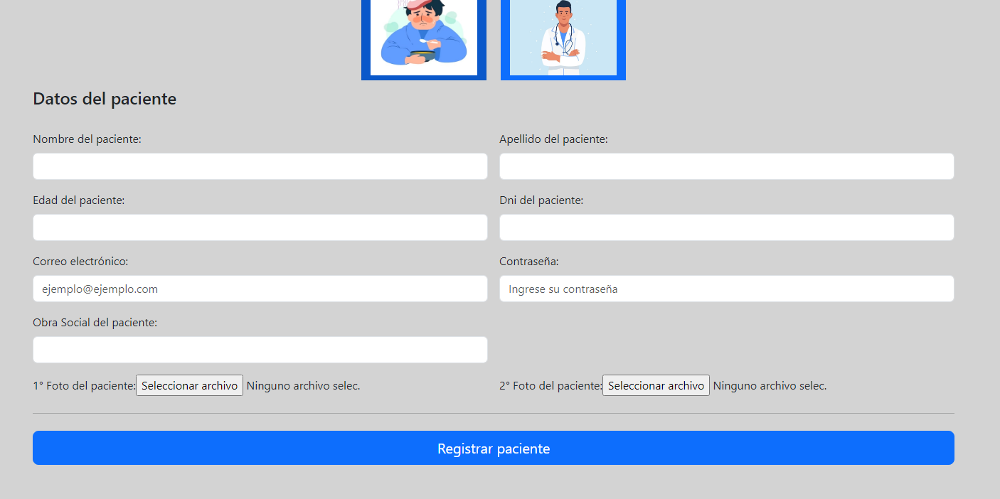

### Especialista - Registro

Se piden los datos necesarios para integrar un especialista al sistema, este debe agregar una foto y seleccionar sus especialidades

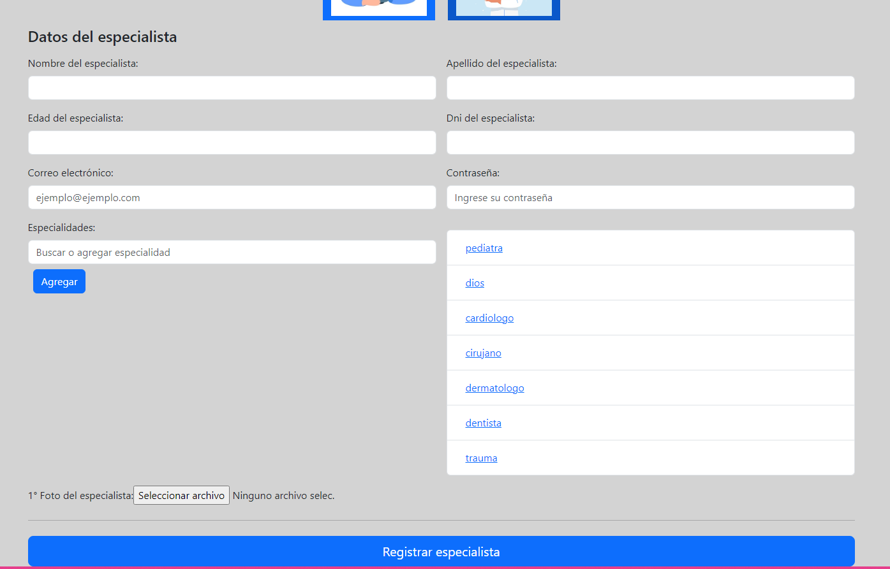

### Inicio sesión

Aca se ingresa el mail y contraseña, ademas contas con accesos rapidos.

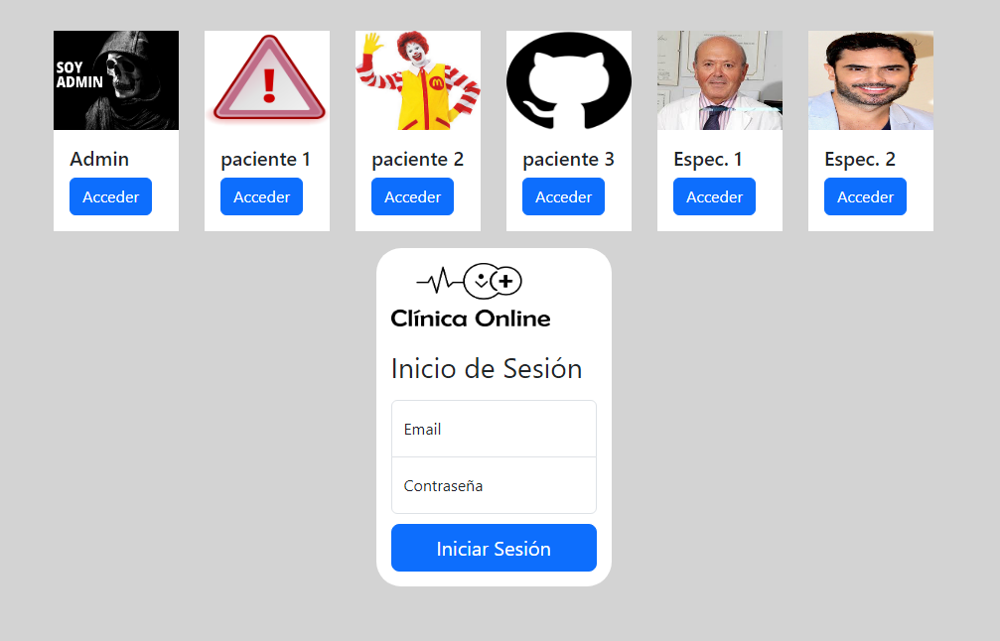

### Mi perfil

Se ven los datos del usuario conectado.
En el caso del paciente se puede acceder a la historia clinica y en el caso de los especialistas a sus horarios.

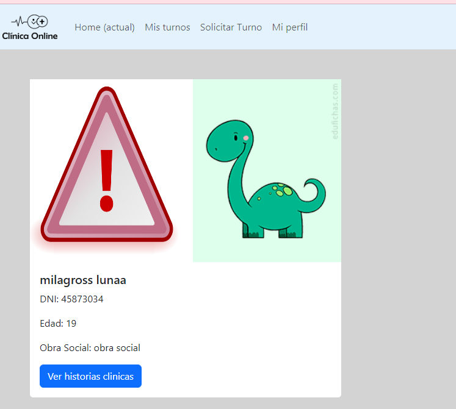

### Historia Clinica

Se ven las historias clinicas del paciente permitiendo descargar la informacion en formato pdf.
En el caso del adminsitrador podra descargar las historias clinicas en formato xlsx (excel).


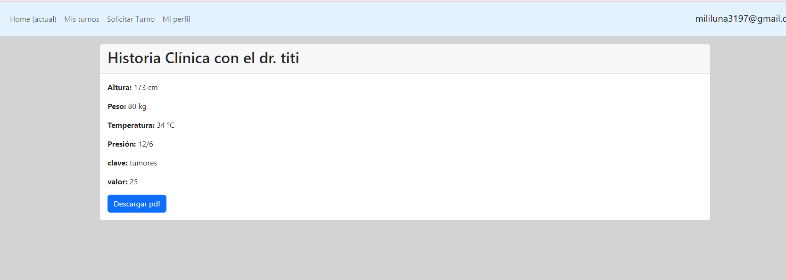

### Solicitar turno

A pedido de la consigna para solicitar turno se muestran las especialidades representadas en imagenes sin el nombre, una vez elegida se ven los especialistas que te pueden atender con foto y nombre y finalmente se muestran los horarios disponibles de hoy a 15 dias, de lunes a viernes de 8 a 19 hs y los sabados de 8 a 14 hs.
En el caso del administrador se agrega el campo que muestra los pacientes para que este pueda elegir para quien es el turno.

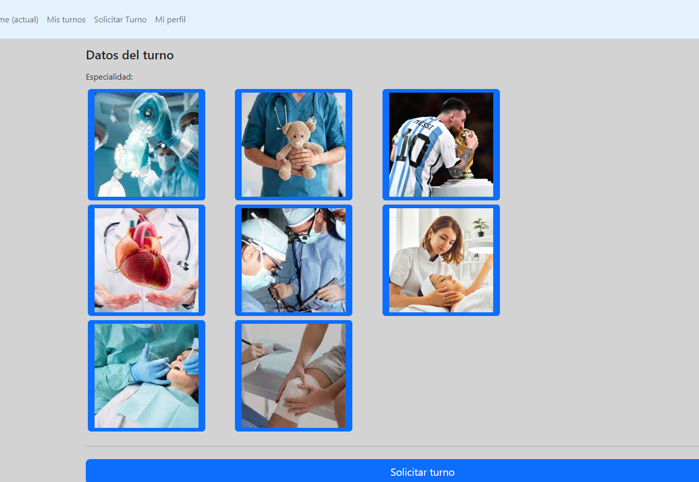
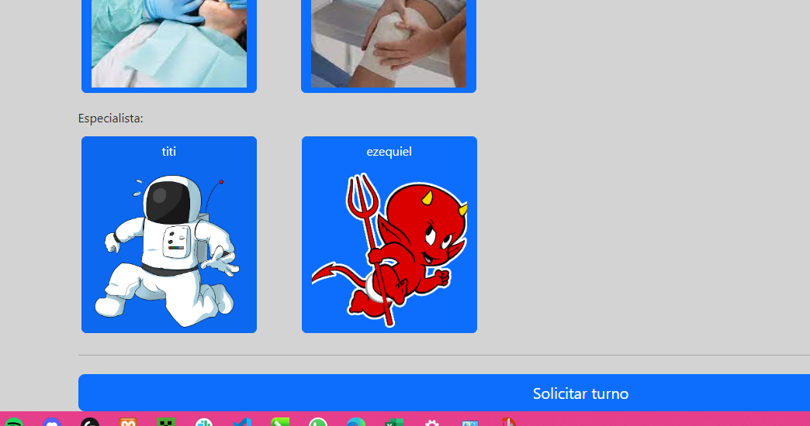
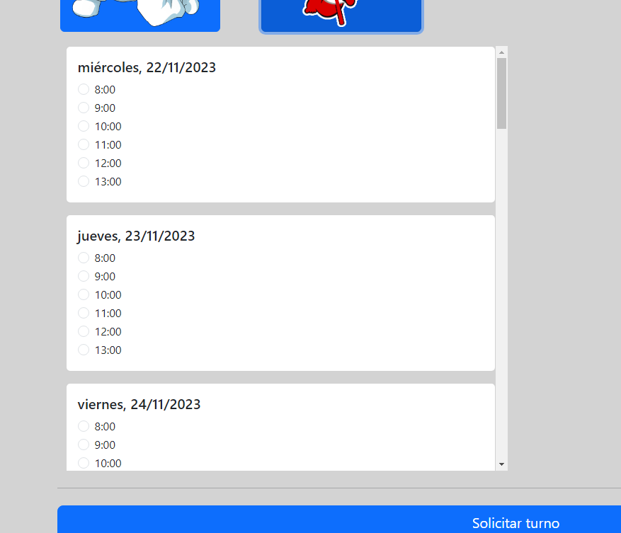

### Mis turnos

Se muestran todos los turnos permitiendo buscar por todos los campos del mismo, dia, hora, especialista, especialidad, etc.
Tambien en caso de ser paciente se pueden cancelar, calificar, ver reseña/comentario y completar una encuesta, y en el
caso de ser especialista se puede aceptar o rechazar, una vez aceptado se puede cancelar, finalizar, una vez que el turno finaliza el especialista debera 
completar la historia clinica y dar una reseña.

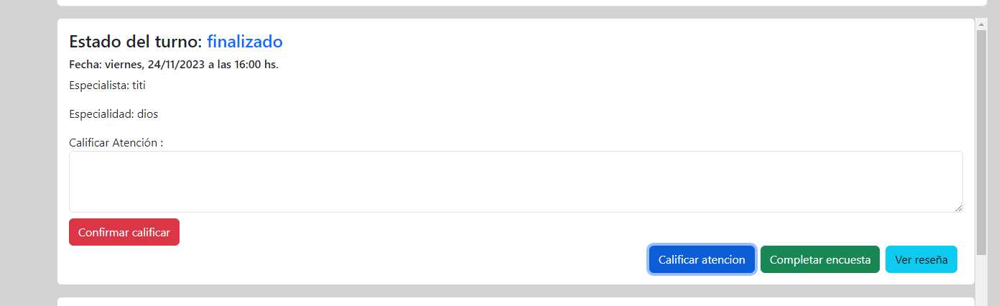
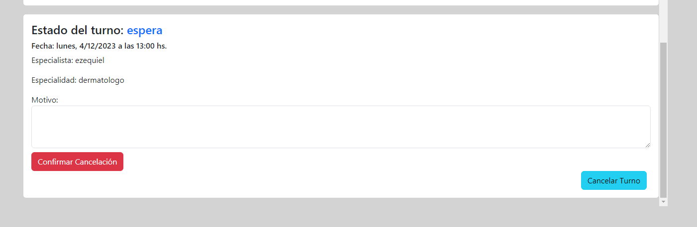
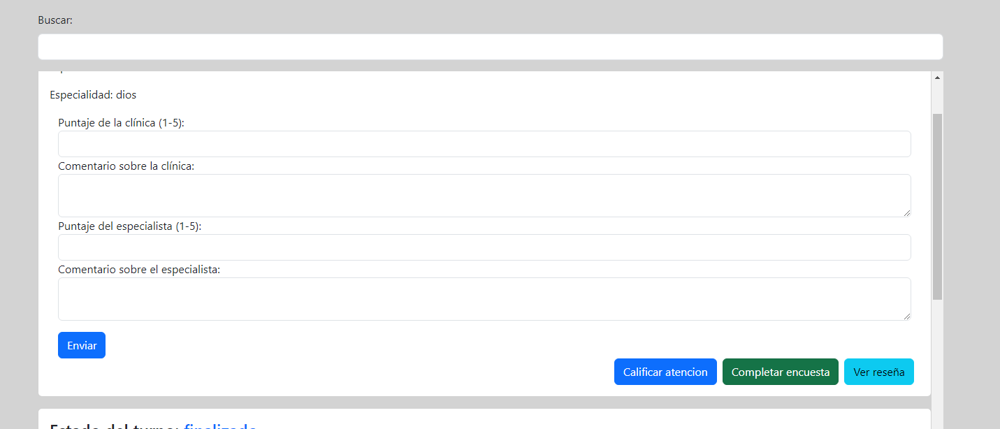
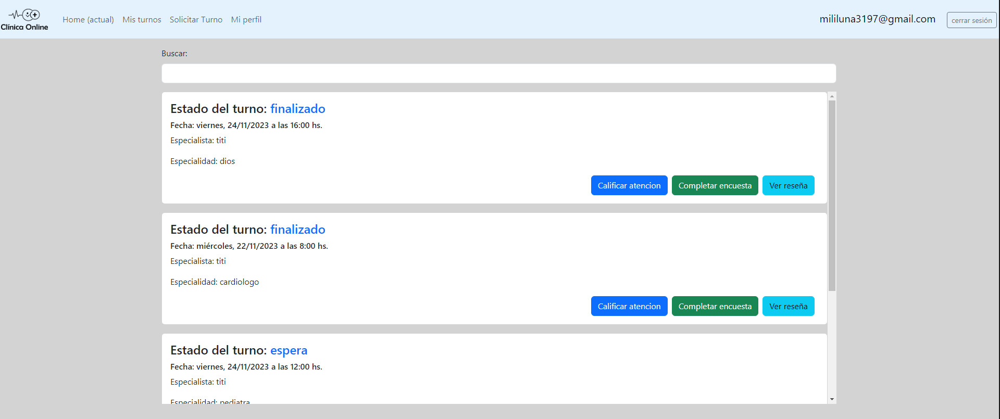

### Administrar turnos

Se muestran todos los turnos permitiendo buscar por especialidad o especialista, el administrador podra cancelar los turnos y dejar un comentario sobre eso.

### Graficos

Se muestran todos los graficos solicitados.

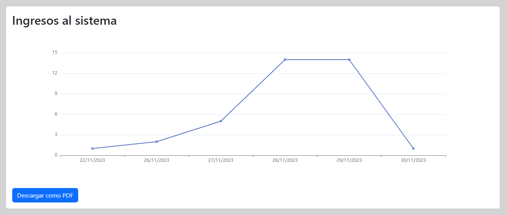
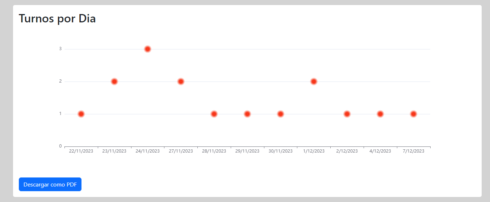
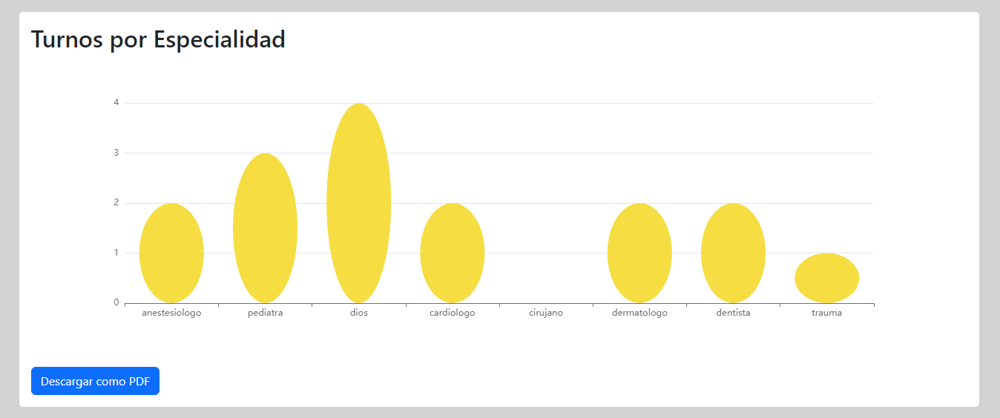
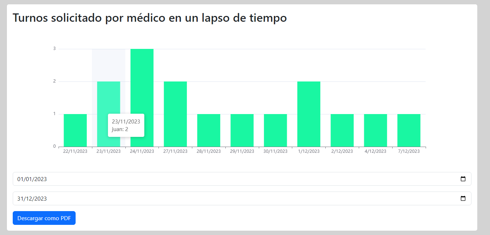
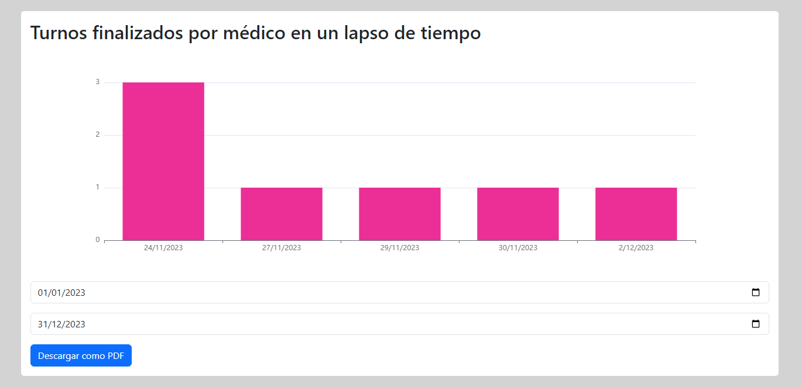

### Directivas

Se utilizan las siguientes

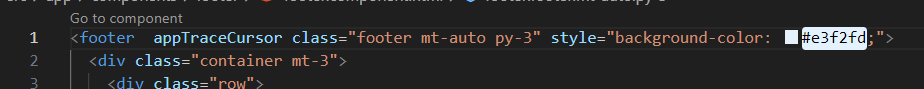
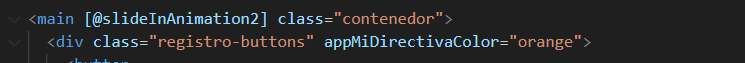
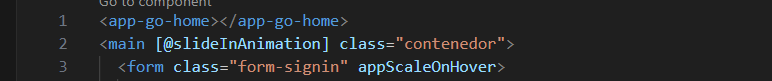

### Pipes

Se utilizan las siguientes

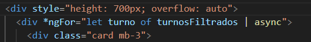
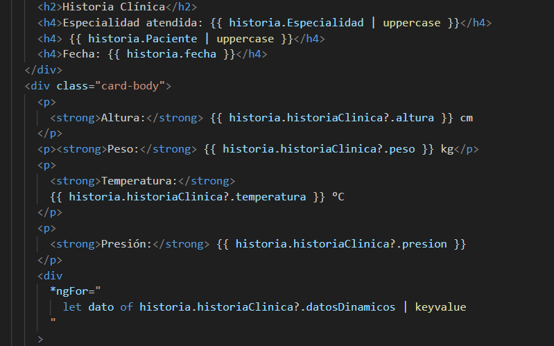
